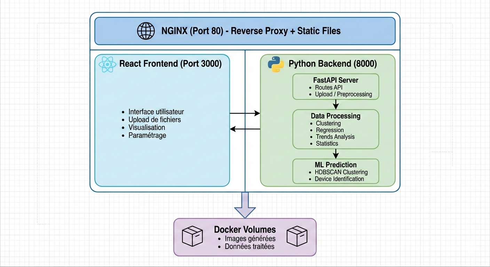
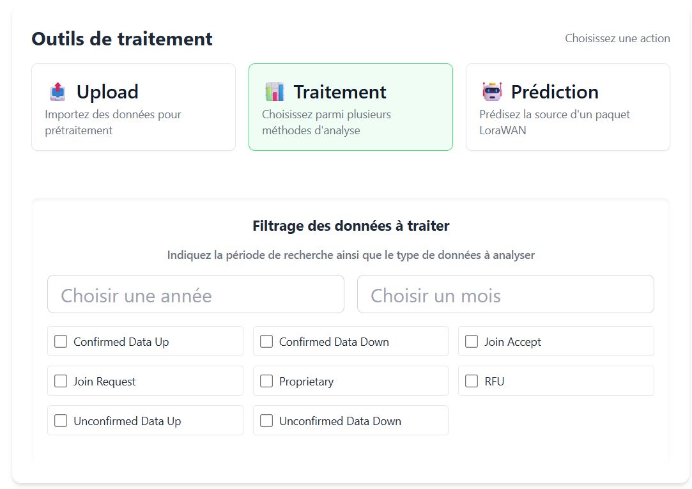

<div align="center">

# 📡 IoT Data Analysis Platform

### Analyse et visualisation de données LoRaWAN

[](LICENCE)
[](https://www.python.org/)
[](https://reactjs.org/)
[](https://www.docker.com/)
[](https://fastapi.tiangolo.com/)

*Plateforme complète d'analyse de trafic IoT avec prétraitement automatisé, clustering, régression et prédiction de dispositifs*

---

🌍 *The plots are in English for global accessibility. The interface is in French.*  
*Feel free to use Google Translate integration within your browser.*

</div>

---

## 📋 Table des matières

- [🎯 Présentation](#-présentation)
- [✨ Fonctionnalités](#-fonctionnalités)
- [🏗️ Architecture](#️-architecture)
- [🚀 Installation](#-installation)
- [📖 Guide d'utilisation](#-guide-dutilisation)
- [🔧 Stack Technique](#-stack-technique)
- [📁 Structure du projet](#-structure-du-projet)
- [🤝 Contributeurs](#-contributeurs)
- [📄 Licence](#-licence)

---

## 🎯 Présentation

Cette plateforme permet d'analyser des **données de trafic LoRaWAN** collectées sur un réseau IoT réel. Elle offre des outils de **prétraitement**, **visualisation**, **analyse statistique** et **prédiction par machine learning**.

Le projet a été développé dans le cadre du cours **SIR Data Analysis for Internet of Things** du département Télécommunications de l'**INSA Lyon**, encadré par **Fabrice Valois** et **Oana Iova**.

Les données analysées proviennent des **deux antennes LoRaWAN du campus de la Doua**.

---

## ✨ Fonctionnalités

### 📊 Prétraitement des données
| Fonctionnalité | Description |
|----------------|-------------|
| **Upload de fichiers** | Import de données JSON brutes (données d'un mois complet) |
| **Filtrage intelligent** | Suppression des valeurs indéfinies et aberrantes |
| **Rolling window** | Paramétrage flexible des intervalles d'agrégation |
| **Export optimisé** | Conversion en format Parquet pour de meilleures performances I/O |

### 📈 Analyse et Traitement
| Module | Description |
|--------|-------------|
| **🔄 Régression** | Modèles IA (HistGradientBoostingRegressor) pour prédire RSSI/SNR et identifier les paramètres physiques les plus impactants |
| **📅 Saisonnalité** | Analyse temporelle multi-échelle (seconde → année) du trafic réseau |
| **🎯 Clustering** | Visualisation 1D/2D/3D de la répartition des paquets selon les métriques (Airtime, BitRate, RSSI, SNR...) |
| **📊 Statistiques** | Tableaux de bord : proportion ADR, répartition par type de paquet, analyse par gateway |

### 🔮 Prédiction de dispositifs
| Approche | Cas d'usage |
|----------|-------------|
| **Dev_EUI** | Identification de dispositifs via leur empreinte radio (anti-spoofing) |
| **Dev_Add** | Estimation du nombre de devices sur le réseau (adresses changeantes) |

---

## 🏗️ Architecture



---

## 🚀 Installation

### Prérequis

- [Docker](https://docs.docker.com/engine/install/) (obligatoire)
- [Docker Compose](https://docs.docker.com/compose/install/)

### Démarrage rapide

```bash
# 1. Cloner le repository
git clone <repository-url>
cd IoT_Data_Analysis

# 2. Lancer l'application
docker-compose up -d

# 3. Accéder à l'interface
# 🌐 http://localhost
```

### Commandes utiles

```bash
# Voir les logs en temps réel
docker-compose logs -f

# Arrêter les services
docker-compose down

# Reconstruire les images
docker-compose up -d --build

# Mise à jour des dépendances React
docker-compose exec react sh -c "npm install && exit"

# Accéder au shell du backend Python
docker-compose exec backend sh
```

---

## 📖 Guide d'utilisation

### 1️⃣ Préparation des données



1. **Upload** : Cliquez sur "Upload" et sélectionnez votre fichier JSON (données d'un mois complet)
2. **Configuration** : Choisissez les paramètres de prétraitement :
   - Sélection des attributs à conserver
   - Méthode de filtrage des valeurs aberrantes
   - Intervalle de rolling window
3. **Traitement** : Patientez pendant le prétraitement automatique

### 2️⃣ Exploitation des données

#### 🔄 Régression / Prédiction
Entraîne des modèles de machine learning pour :
- Prédire le **RSSI** et le **SNR**
- Identifier l'**importance des features** (permutation importance)
- Visualiser les corrélations entre paramètres physiques

#### 📅 Analyse de saisonnalité
Génère des graphiques à différentes échelles temporelles :
- Par seconde / minute / heure
- Par jour / semaine / mois
- Comparaison avec des patterns de trafic humain classique

#### 🎯 Clustering
Visualisation de la répartition des paquets :
- Graphiques 1D, 2D ou 3D
- Métriques disponibles : `Airtime`, `BitRate`, `RSSI`, `SNR`, `SF`, `Bandwidth`...

#### 📊 Statistiques
Tableaux de bord complets :
- Proportion de paquets par type (Confirmed Data Up/Down, Join Request...)
- Répartition ADR (Adaptive Data Rate)
- Analyse par gateway (`GW_EUI`)
- Distribution des opérateurs

### 3️⃣ Prédiction de dispositifs

| Mode | Description | Données |
|------|-------------|---------|
| **Dev_EUI** | Identification du dispositif par empreinte radio | Peu de données (Join Request uniquement) |
| **Dev_Add** | Groupement de paquets par caractéristiques physiques | Beaucoup de données (adresse changeante) |

**Cas d'usage** :
- 🛡️ **Anti-spoofing** : Détecter les paquets usurpant une identité
- 📱 **Dimensionnement** : Estimer le nombre réel de devices sur le réseau et les tendances d'utilisation des ressources radios
- ⚡ **Optimisation réseau**: Regarder comment un réseau réel est utilisé pour adapter l'architecture réseau (emplacement des antennes, ADR, ...)
---

## 🔧 Stack Technique

### Backend
| Technologie | Utilisation |
|-------------|-------------|
|  **Python 3.14** | Langage principal |
|  **FastAPI** | API REST haute performance |
|  **Uvicorn** | Serveur ASGI avec hot-reload |
|  **Pandas** | Manipulation de données |
|  **scikit-learn** | Machine Learning (régression, classification) |
|  **HDBSCAN** | Clustering densité-based |
|  **Matplotlib** | Génération de graphiques |
| **ijson** | Parsing JSON streaming (gros volumes) |
| **PyArrow** | Export format Parquet optimisé |
| **cachetools** | Mise en cache intelligente |

### Frontend
| Technologie | Utilisation |
|-------------|-------------|
|  **React 19** | Framework UI |
|  **Tailwind CSS 4** | Styling utilitaire |
| **react-dropzone** | Upload drag & drop |
| **react-datepicker** | Sélection de dates |
| **react-router-dom** | Navigation SPA |

### Infrastructure
| Technologie | Utilisation |
|-------------|-------------|
|  **Docker** | Conteneurisation |
|  **NGINX** | Reverse proxy & serveur statique |

---

## 📁 Structure du projet

```
IoT_Data_Analysis/
│
├── 🐳 docker-compose.yml      # Orchestration des services
├── 🐳 Dockerfile              # Build multi-stage (backend, react, nginx)
├── ⚙️  default.conf            # Configuration NGINX
│
├── 🐍 backend/
│   ├── server/
│   │   ├── main.py            # Point d'entrée FastAPI
│   │   ├── models/            # Schémas Pydantic
│   │   └── routes/            # Endpoints API
│   │       ├── clustering.py
│   │       ├── regression.py
│   │       ├── stats.py
│   │       └── trends.py
│   │
│   ├── preprocessing/
│   │   ├── preprocessing.py   # Interface Tkinter (mode local)
│   │   ├── automaticPreProcessing.py
│   │   ├── flatten_datas.py   # Aplatissement JSON
│   │   ├── useData.py         # Chargement données
│   │   └── GUIDE.md           # Documentation prétraitement
│   │
│   └── data_processing/
│       ├── clustering/
│       │   ├── clustering.py          # Visualisation clustering
│       │   ├── predict_dev_add/       # Prédiction par Dev_Add
│       │   └── predict_dev_eui/       # Prédiction par Dev_EUI
│       ├── regression/
│       │   └── regression.py          # Modèles RSSI/SNR
│       ├── stats/
│       │   ├── paquets.py             # Statistiques paquets
│       │   ├── adr.py                 # Analyse ADR
│       │   └── devices.py             # Analyse devices
│       └── trends_analysis/
│           └── trends_analysis.py     # Analyse saisonnalité
│
└── ⚛️  frontend/
    ├── package.json
    ├── tailwind.config.js
    ├── public/
    │   └── index.html
    └── src/
        ├── App.js
        ├── menu/
        │   └── Menu.jsx               # Navigation principale
        ├── preprocessing/
        │   ├── DropFile.jsx           # Upload fichiers
        │   └── AnalysisMenu.jsx       # Menu d'analyse
        ├── data_processing/
        │   ├── Clustering.jsx
        │   ├── Regression.jsx
        │   ├── Stat.jsx
        │   └── Trends.jsx
        └── prediction/
            ├── DevicePredictionDevAdd.jsx
            └── DevicePredictionDevEUI.jsx

```

---

## 🤝 Contributeurs

<table>
  <tr>
    <td align="center">
      <b>Titouan Verdier</b><br>
      <sub>3D Plots & AI Clustering</sub>
    </td>
    <td align="center">
      <b>Paul-Henri Lucotte</b><br>
      <sub>AI Regression and Trends Prediction</sub>
    </td>
    <td align="center">
      <b>David Magoudaya</b><br>
      <sub>Plot Analysis</sub>
    </td>
    <td align="center">
      <b>Charles Bouquet</b><br>
      <sub>Architecture, Stats & DevOps</sub>
    </td>
  </tr>
</table>

### Encadrement

- **Fabrice Valois** - INSA Lyon/INRIA Agora, Département Télécommunications
- **Oana Iova** - INSA Lyon/INRIA Agora, Département Télécommunications

---

## 📄 Licence

Ce projet est sous licence **Apache 2.0**. Voir le fichier [LICENCE](LICENCE) pour plus de détails.

---

<div align="center">

### 🏛️ Réalisé à l'INSA Lyon

**Département Télécommunications - Projet SIR Data Analysis for IoT**

<br>


&nbsp;&nbsp;&nbsp;&nbsp;


<br><br>

*Les données analysées dans le rapport proviennent des antennes LoRaWAN du campus de la Doua*

---

⭐ **N'hésitez pas à star le projet si vous le trouvez utile !** ⭐

</div>